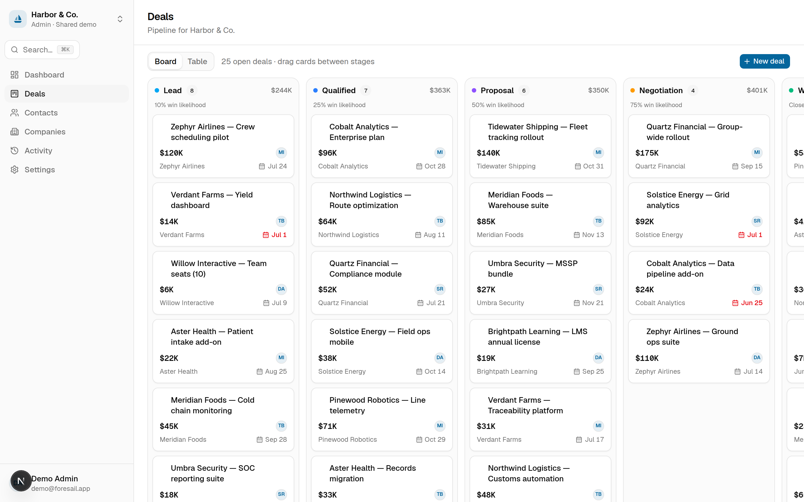
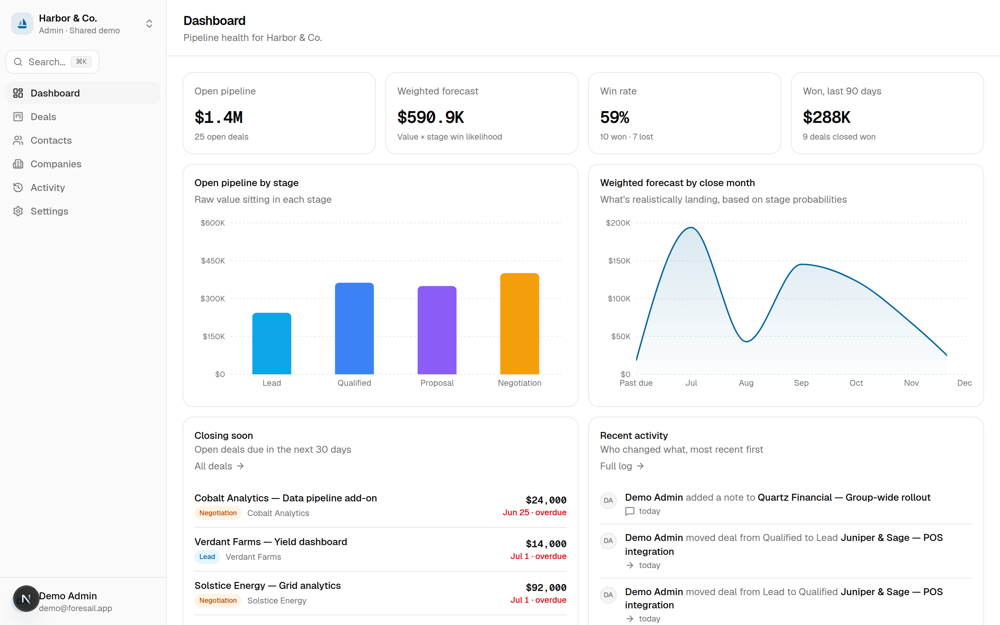
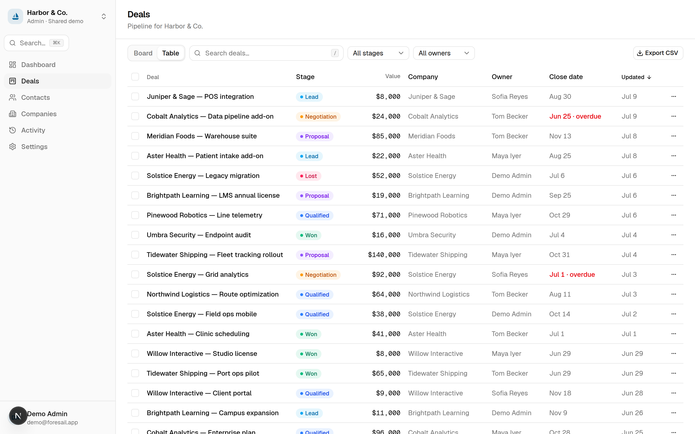
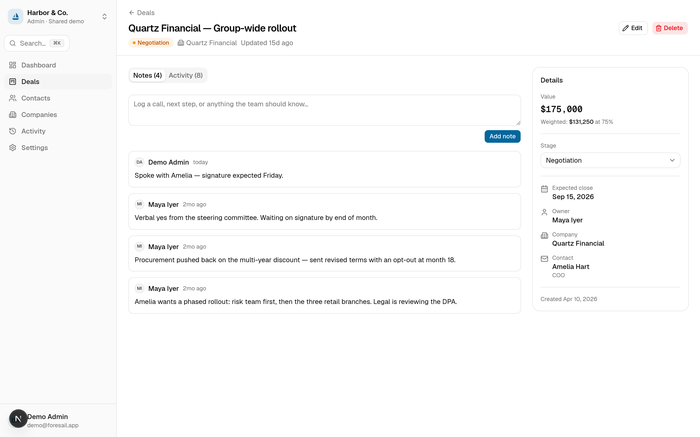
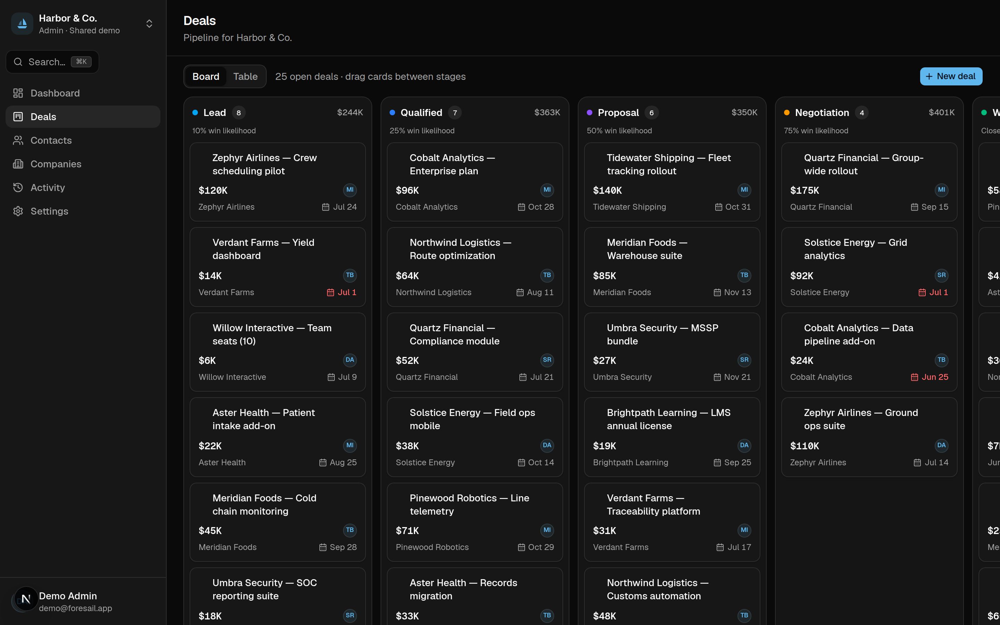

<div align="center">

# ⛵ Foresail

**A CRM that stops the pipeline from lying — kanban deals with weighted revenue forecasting.**

[](__GH_REPO__/actions/workflows/ci.yml)
[](LICENSE)
[](https://nextjs.org)
[](https://www.prisma.io)

**Live demo → __LIVE_URL__**

*Sign in with* `demo@foresail.app` / `demo1234` *(full edit access, resets nightly)*



</div>

---

A $50,000 deal at first call is not $50,000 of revenue. Foresail is a CRM for small B2B sales
teams where **every pipeline stage carries a win likelihood**, so the dashboard forecast is
`Σ (value × probability)` by close month — a number you can defend, instead of the sum of your
optimism.

Built end-to-end as a [Digital Heroes](#credits) full-stack trial project: real auth, real
database, real deployment — and open source under MIT.

## Features

- **Drag-and-drop kanban board** — optimistic moves with rollback on failure, keyboard-accessible
  drag, per-card stage menu, and drop-to-win/lose with the close date handled for you.
- **Weighted forecasting** — tune each stage's win likelihood; the dashboard charts raw pipeline
  by stage and weighted forecast by expected close month, with past-due and unscheduled deals
  called out instead of hidden.
- **Deals, contacts & companies** — full CRUD with server-validated relations, notes timeline on
  every deal, soft delete with one-click undo.
- **Find anything** — debounced server-side search (trigram-indexed), AND-combined filters
  mirrored into the URL, indexed sorts, and cursor pagination that stays stable under writes.
- **Bulk actions & CSV export** — select-all-across-pages with a confirm step, bulk stage moves,
  and streamed CSV exports of any filtered view.
- **Team roles that hold** — owner/admin/member/viewer enforced server-side on every action,
  shareable invite links (hashed, expiring, revocable), and an append-only audit trail.
- **Real auth** — email + password with bcrypt (cost 12), email verification gating writes,
  single-use hashed reset tokens, Postgres-backed rate limiting, and strict security headers.
- **Fast to drive** — ⌘K command palette, `/` to search, four designed states everywhere
  (loading skeletons, useful empty states, actionable errors, success toasts), system-aware dark
  mode, WCAG AA checked with axe (0 violations on every core page).

## Tech stack

Next.js 16 (App Router) · TypeScript strict · PostgreSQL + Prisma 7 · Auth.js v5 · Tailwind CSS 4
+ shadcn/ui · Zod 4 · dnd-kit · Recharts · Vitest + Playwright · GitHub Actions · Vercel

## Quick start

```bash
git clone __GH_REPO__.git
cd foresail
cp .env.example .env        # then set DATABASE_URL + AUTH_SECRET
npm install
npm run db:migrate          # apply migrations
npm run db:seed             # demo workspace + demo logins
npm run dev                 # http://localhost:3000
```

Any PostgreSQL works — local, [Neon](https://neon.tech), or [Supabase](https://supabase.com).
Generate a session secret with `openssl rand -base64 32`.

### Demo logins (after seeding)

| Account | Password | Role |
| --- | --- | --- |
| `demo@foresail.app` | `demo1234` | Admin — full edit access |
| `viewer@foresail.app` | `demo1234` | Viewer — read-only, for testing RBAC |

## Environment variables

| Variable | Required | Description |
| --- | --- | --- |
| `DATABASE_URL` | ✅ | PostgreSQL connection string |
| `AUTH_SECRET` | ✅ | Session-signing secret (`openssl rand -base64 32`) |
| `NEXT_PUBLIC_APP_URL` | ✅ | Canonical URL of the deployment, no trailing slash |
| `AUTH_TRUST_HOST` | – | Set `"true"` behind proxies / non-Vercel hosts |
| `RESEND_API_KEY` | – | Enables real verification/reset email. Without it the app runs in **demo mail mode**: verification links appear on-screen; reset links are never issued (see [architecture notes](docs/architecture.md)) |
| `EMAIL_FROM` | – | Sender for transactional email, e.g. `Foresail <mail@yourdomain.com>` |
| `CRON_SECRET` | – | Protects `/api/cron/reset-demo` (nightly demo reseed) |

## Architecture

Multi-tenant workspaces hang everything off a `Workspace` row; roles live on the membership, and
**every** server action re-checks session → membership → role → row ownership before touching a
row. Money is integer cents end-to-end; the forecast is a pure, unit-tested module. The kanban
board does optimistic updates against fractional-indexed positions with a renormalization guard.

One diagram and every non-obvious decision (JWT sessions, demo-mail mode, cursor pagination,
soft deletes) live in **[docs/architecture.md](docs/architecture.md)**.

## Testing

```bash
npm test              # 40 unit tests (forecast math, RBAC, validators, cursor codec)
npm run test:e2e      # Playwright: login → create → move → note → delete, RBAC, signup flow
npm run lint          # ESLint
npm run typecheck     # tsc --noEmit (strict)
```

CI runs all of the above plus a production build against Postgres 16 on every push.

## Screenshots

| Dashboard | Deals table |
| --- | --- |
|  |  |

| Deal detail | Dark mode |
| --- | --- |
|  |  |

## Roadmap

- [x] Kanban pipeline, weighted forecast, contacts/companies, roles, audit log, CSV export
- [ ] Deal attachments and @mentions in notes
- [ ] Email digests (weekly forecast to your inbox)
- [ ] Public API with scoped keys
- [ ] Import from CSV / other CRMs

## Contributing

PRs welcome — see [CONTRIBUTING.md](CONTRIBUTING.md) for setup, branch naming, and how to run
the checks locally. Please open an issue first for anything non-trivial.

## Credits

Designed and built for the **Digital Heroes Full-Stack Developer Trial** — an end-to-end build
exercise: one real product from empty repo to deployed, documented, open-source software.

## License

[MIT](LICENSE) — do what you like, a credit is appreciated.
